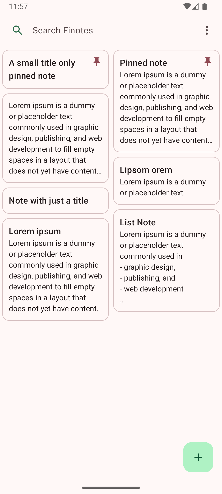
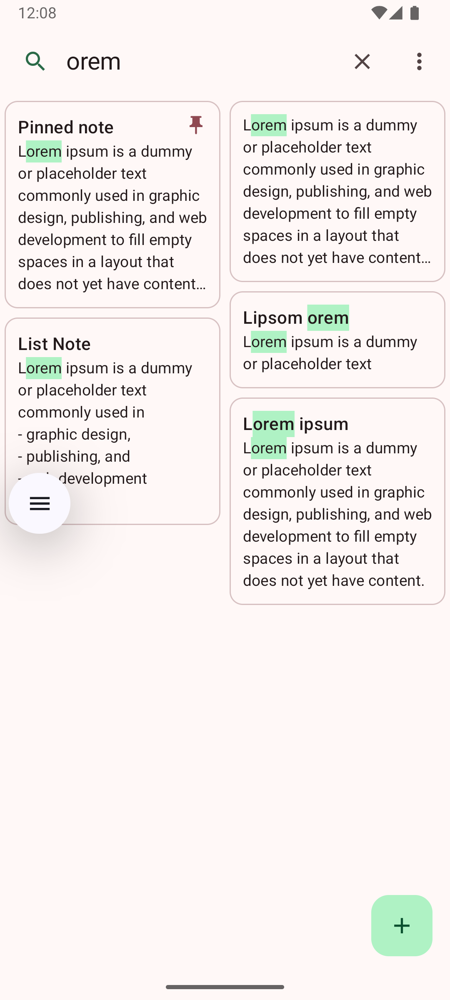
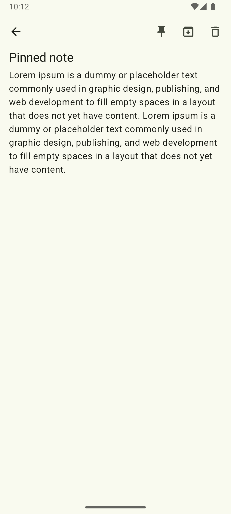
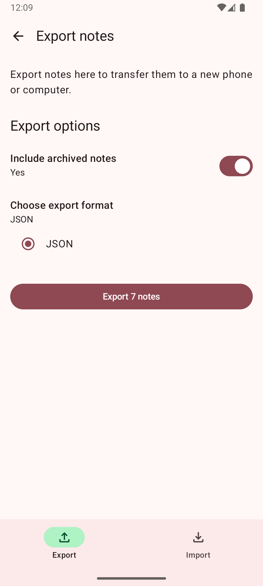

# Finotes

Finotes is *simple*, *modern* and *private*.
The notes are only stored *locally* on your phone.
This is a project for friends and family.

## Features

- **Create Notes**: Easily create and edit notes with auto-saving functionality.
- **Search**: Quickly find notes using the search functionality.
- **Pin Notes**: Pin important notes to keep them at the top.
- **Archive**: Archive notes to keep them out of the way but still accessible.
- **Bin**: Move notes to the bin and restore or permanently delete them.
- **Dark Mode**: Use the app in dark mode for a better reading experience.
- **Export and Import**: Export notes to a file and import them back.

## Screenshots

    
    
    
    

## Contributing and Development

Contributions or feature requests are welcome:)

This project was developed following the most recent Android development best practices and guidelines.
These include:
- Using Jetpack Compose for UI development.
- Using Kotlin for the entire codebase.
- Following the MVVM architecture pattern. 
  - Keep the UI logic separate from the underlying logic.
  - Use a ViewModel class to manage the UI-related data.
- Using Room for local data storage.
  - Use a note model class to represent the data in the database.
  - Use a DAO interface to define the database operations.
  - Use a database class to define the database instance.
  - Use a repository class to manage the data operations of several data sources of notes.
  - Instantiate the database and repository in the MainActivity and pass them to the ViewModel which is then passed to the Screens.

## License

This project is licensed under the MIT License.

---

*Note: This app is a work in progress and new features are being added regularly.*
