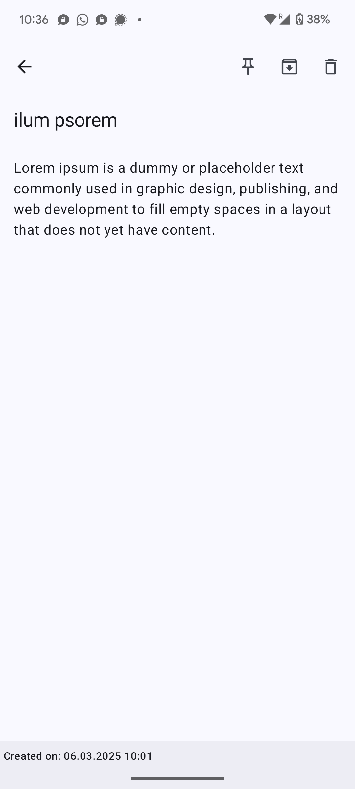
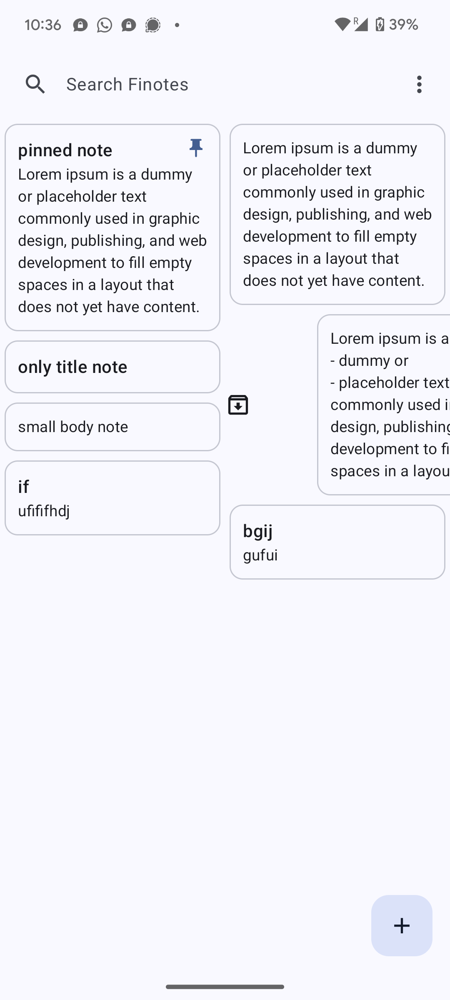

# Finotes

Finotes is *simple*, *modern* and *private*.
The notes are only stored *locally* on your phone.
This is a project for friends and family.

## Features

- **Create Notes**: Easily create and edit notes with auto-saving functionality.
- **Search**: Quickly find notes using the search functionality.
- **Pin Notes**: Pin important notes to keep them at the top.
- **Bin**: Move notes to the bin and restore or permanently delete them.
- **Dark Mode**: Use the app in dark mode for a better reading experience.
- **Swipe to Archive**: Swipe notes to quickly archive them.

## Screenshots

## Contributing and Development

Contributions are welcome! Please fork the repository and submit a pull request.

This project was developed following the most recent Android development best practices and guidelines. Please make sure to follow them when contributing.
These include:
- Using Jetpack Compose for UI development.
- Using Kotlin for the entire codebase.
- Following the MVVM architecture pattern. Keep the UI logic separate from the underlying logic.
- Using LiveData and ViewModel for data management. Use Flows for asynchronous operations.
    - Use a ViewModel class to manage the UI-related data.
    - ViewModel is only passed to Screens. Screens pass functions and data to child composable.
- Using Room for local data storage.
    - Use a note model class to represent the data in the database.
    - Use a DAO interface to define the database operations.
    - Use a database class to define the database instance.
    - Use a repository class to manage the data operations of several data sources of notes.
    - Instantiate the database and repository in the MainActivity and pass them to the ViewModel which is then passed to the Screens.
- Writing clean and readable and modular code. Follow the given folder structure.
    - Reusable composables should be in the `ui/components` package.
    - Screens should be in the `ui/screens` package.
    - Viewmodels should be in the `ui/viewmodels` package.

## License

This project is licensed under the MIT License.

---

*Note: This app is a work in progress and new features are being added regularly.*