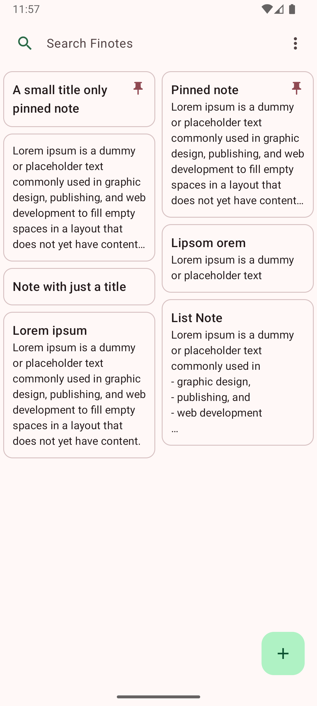
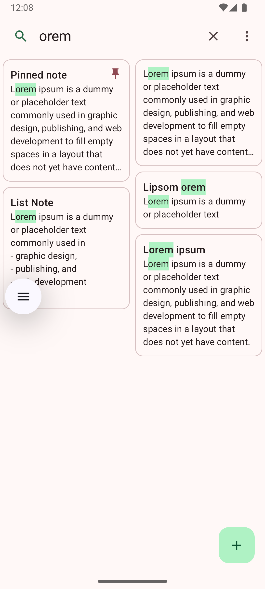
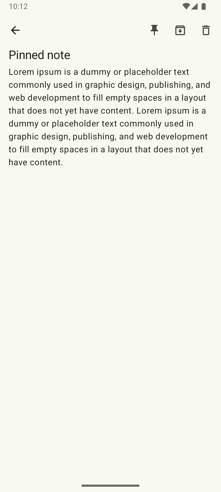
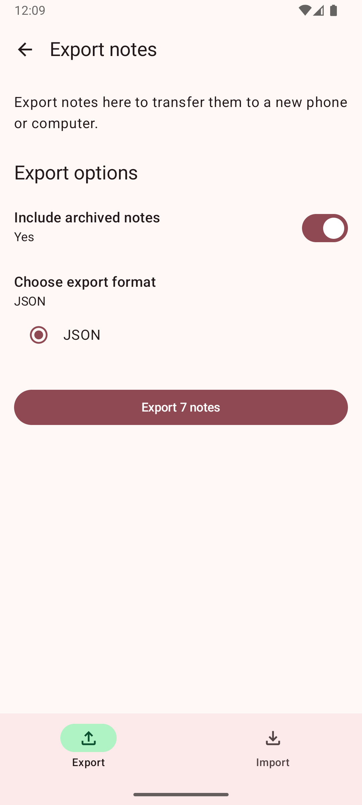

# Finotes

Finotes is *simple*, *modern* and *private*.
The notes are only stored *locally* on your phone.
This is a project for friends and family.

## Features

- **Private by design**: No internet access, no cloud sync, no tracking. Your notes stay on your device.
- **Export & import**: Backup notes to a file or move them between devices.
- **Auto-save**: Notes save instantly as you type.
- **Search**: Find notes quickly with full-text search.
- **Pin notes**: Keep important notes at the top.
- **Archive**: Hide notes you don’t need right now.
- **Bin**: Delete notes with a safety net—restore or empty the bin anytime.
- **Dark mode**: Easy on the eyes, day or night.

## Screenshots

    
    
    
    

## Technical Details

Built with modern Android development tools:
- **Jetpack Compose**: Declarative UI for a smooth, responsive interface.
- **Kotlin**: Clean, concise code with full null safety.
- **MVVM architecture**: Separates UI from business logic for easier maintenance.
- **Room**: Robust local database with migrations and validation.
- **Hilt**: Dependency injection for cleaner, testable code.

## Contributions

Contributions are welcome! Open an issue or submit a pull request. Report any bugs, suggest features and create pull requests to help improve Finotes.

## License

MIT License. Use, modify, and share freely.

---
